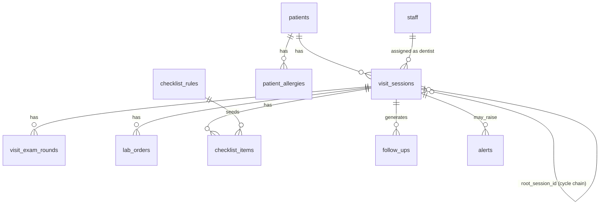
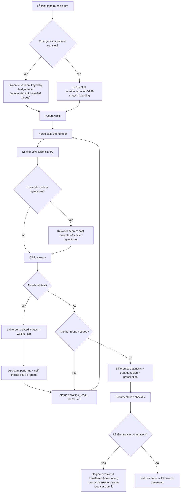

# dental-zenflow — Architecture

This document describes the system after it was rebuilt around the clinic's
actual patient-visit flow (see the flowchart in the "Patient visit flow"
section). It replaces the earlier pre-booked-appointment model.

## Stack

- **Frontend**: React 19 + TanStack Router/Start (file-based routing, SSR
  shell) + TanStack Query for data fetching/caching, Tailwind CSS + shadcn/ui
  components.
- **Backend**: Supabase (Postgres + Auth + Realtime), accessed directly from
  the client via `@supabase/supabase-js` (no separate API server — business
  logic lives either in the React route components or in Postgres
  functions/triggers, matching the project's existing convention).
- **i18n**: a flat `vi`/`en` string dictionary in `src/lib/i18n.tsx` — every
  UI label and enum value is a lookup key present in both languages.
- **Project sync**: connected to Lovable; commits on the tracked branch sync
  back to the Lovable editor.

## Roles

| Role | Vietnamese | Actor in the visit flow |
|---|---|---|
| `receptionist` | Lễ tân | Checks patients in, assigns queue numbers, finalizes visits / inpatient handoff |
| `assistant` | Trợ lý / Điều dưỡng | Calls patients from the queue |
| `dentist` | Nha sĩ / Bác sĩ | Examines, orders labs, diagnoses, treats |
| `admin` | Quản trị | Full access to everything, incl. role assignment |

There is no dedicated lab-technician role — lab orders (`lab_orders`) are
completed by whoever holds `assistant`, via a "pending lab orders" section on
`/queue`, alongside their queue-calling duty. (The `lab_technician` value
still exists in the `app_role` Postgres enum from an earlier iteration —
removing an enum value cleanly requires rebuilding the type and touches
every table/function/RLS policy that references it, so it was left in place,
unused and unassignable from `/admin`, rather than risk that migration.)

A user's roles live in `user_roles` (one or more rows per user); `is_staff()`
and `has_role()` are `SECURITY DEFINER` SQL functions used throughout RLS
policies. Most tables use a blanket "any authenticated staff member" policy;
a handful (`user_roles`, `checklist_rules`, `staff` self-management) are
role-gated at the database level. Everywhere else, role gating is enforced
in the UI (e.g. `canCheck()` in the exam page, sidebar item visibility) —
consistent with how the project already worked before this change.

## Data model

Core entities (see `supabase/migrations/` for the authoritative schema):

- **`patients`**, **`patient_allergies`**, **`staff`**, **`user_roles`** —
  unchanged from before.
- **`visit_sessions`** — the queue/visit entity, replacing the old
  `appointments` + `treatment_sessions` pair. One row per numbered visit.
  Key fields: `session_number` (daily 0-999) or `bed_number` (emergency/
  inpatient), `is_emergency`, `status`, `current_round`, `root_session_id` +
  `cycle_number` (inpatient-cycle chaining), `chief_complaint`,
  `assigned_dentist_id`, `procedure_type`/`diagnosis`/`treatment_plan`/
  `prescription` (filled in at finalize), `compliance_score`.
- **`visit_exam_rounds`** — one row per doctor call/round for a session
  (`round_number`, `dentist_id`, `symptoms_note`, `crm_lookup_used`,
  `clinical_exam_note`, `needs_lab`).
- **`lab_orders`** — one row per requested test (`round_number`,
  `test_name`, `status`, `completed_by`/`completed_at`/`result_note`).
- **`checklist_rules`** (unchanged) / **`checklist_items`** — documentation/
  compliance checklist, now seeded when a visit is finalized (procedure type
  becomes known) instead of at booking time.
- **`follow_ups`** — recall/follow-up queue, now generated off
  `visit_sessions` reaching `status = 'done'` instead of the old
  `treatment_sessions.pipeline_status = 'closed'`. Still surfaced on
  `/follow-ups` and the dashboard's overdue-follow-ups KPI.
- **`alerts`** — unchanged in shape, now points at `visit_sessions`.
- **`daily_session_counters`** — one row per day, backing the atomic
  0-999 queue-number generator.

## Patient visit flow

Mapped directly onto the schema: `pending → called → in_exam →
(waiting_lab ⇄ lab_orders) → waiting_recall → … → finalizing → done` (or
`transferred` if the visit spawns an inpatient cycle). `visit_sessions.
status` is the enum `visit_status`.

## Page / route map

| Route | Actor | Purpose |
|---|---|---|
| `/checkin` | Lễ tân | Check-in (assign number/bed) + finalize/discharge decisions |
| `/queue` | Điều dưỡng | Call board (normal + emergency/bed queue) + pending lab orders self-check-off |
| `/visits/$id` | Bác sĩ | Exam workspace: CRM history, symptom search, lab orders, round progression, finalize, documentation checklist |
| `/dashboard` | all | KPIs, visit-status Kanban, alerts feed, exception log |
| `/patients`, `/patients/$id` | all | Patient directory, allergies, visit history |
| `/follow-ups` | all | Recall queue (unchanged concept, repointed to `visit_sessions`) |
| `/admin` | admin | Staff/role management |
| `/crm` | admin | Placeholder CRM area — bulk data upload only, other CRM features (lookup/matching against the doctor's symptom search) are future work |
| `/my-checklist/$id` | Bệnh nhân (public, no login) | Mobile-first, read-only view of their own lab-order checklist for one `visit_sessions.id`, polling every 15s |

`/my-checklist/$id` sits outside the `_authenticated` layout (patients have no
`auth.users`/`user_roles` row). It never queries `visit_sessions`/`lab_orders`
directly — it calls `get_patient_checklist(p_session_id)`, a `SECURITY
DEFINER` Postgres function granted `EXECUTE` to `anon`, which returns only
session_number/bed_number/cycle_number/patient_name plus each lab order's
test_name/status/round_number for that one id (no diagnosis, no other
patients, no way to enumerate sessions). The link
(`/my-checklist/{visit_sessions.id}`) is handed to the patient by staff — a
"Copy patient link" button and a "QR code" button (generated client-side with
the `qrcode` package, no third-party image service involved) sit next to the
lab-orders list on `/visits/$id`. Access control is capability-based (an
unguessable UUID in the URL), not RLS — this is the same trust model as e.g.
a calendar invite link, and is why the function is scoped to the absolute
minimum columns rather than opening `visit_sessions`/`lab_orders` to `anon`
reads.

`/crm` uploads go to a private Supabase Storage bucket (`crm_data`), with a
`storage.objects` RLS policy restricting all access to `has_role(auth.uid(),
'admin')` — this is intentionally a stub (upload/list/download/delete a raw
file) ahead of building the actual CRM data pipeline that would feed the
symptom-similarity search on `/visits/$id`.

## Realtime & RLS conventions

- Tables that drive live boards (`visit_sessions`, `visit_exam_rounds`,
  `lab_orders`, `alerts`, `follow_ups`) are added to the `supabase_realtime`
  publication with `REPLICA IDENTITY FULL`; pages subscribe via
  `supabase.channel(...).on("postgres_changes", ...)` and invalidate the
  relevant TanStack Query key.
- RLS: `is_staff(auth.uid())` blanket policy on most clinical tables (any
  logged-in staff member can read/write); `has_role(auth.uid(), 'admin')`
  gates role/staff administration. Fine-grained "who's allowed to check off
  this item" logic is enforced in the UI, not the database — matching the
  original project's approach.
- Pure trigger functions (`assign_session_number`, `seed_checklist_on_
  procedure_set`, `generate_followups_on_done`, `next_daily_session_number`)
  have `EXECUTE` revoked from `authenticated`/`anon` — they only ever run as
  the trigger owner, never via direct RPC.

## Key business rules

- **Daily queue numbering**: `daily_session_counters` + `next_daily_
  session_number()` atomically hand out 0-999 per calendar day (wraps via
  `% 1000`). Emergency/inpatient sessions skip this and use `bed_number`
  instead, so they never compete with the normal queue.
- **Cycles**: a cycle-continuation session (`root_session_id` set) inherits
  its `session_number`/`bed_number`/`is_emergency` from the root row — this
  is what produces "cycle1 #58, cycle2 #58" in the UI. The root session is
  marked `transferred`, not `done`, when a cycle spawns.
- **Rounds**: `visit_sessions.current_round` + one `visit_exam_rounds` row
  per round. A round advances either because the doctor explicitly recalls
  the patient, or because the last `lab_orders` row for the round completes
  (both push the session to `waiting_recall` and bump `current_round`).
- **Checklist seeding**: moved from "on appointment creation" to "when the
  doctor sets `procedure_type` at finalize" — procedure type is genuinely
  unknown until the visit concludes in this flow.

## Known simplifications

- The "find patients treated for similar symptoms" CRM lookup is a plain
  `ilike` keyword search over past `chief_complaint`/`diagnosis`/
  `symptoms_note`, not an AI/semantic similarity match.
- No hardware integration (queue display board, audio paging) — "calling a
  number" is a UI action that updates `visit_sessions`/`visit_exam_rounds`.
- No hard cap on recall rounds; the flow can loop as many times as the
  doctor needs.
- New-patient creation during check-in has no duplicate-detection beyond the
  existing name search.
