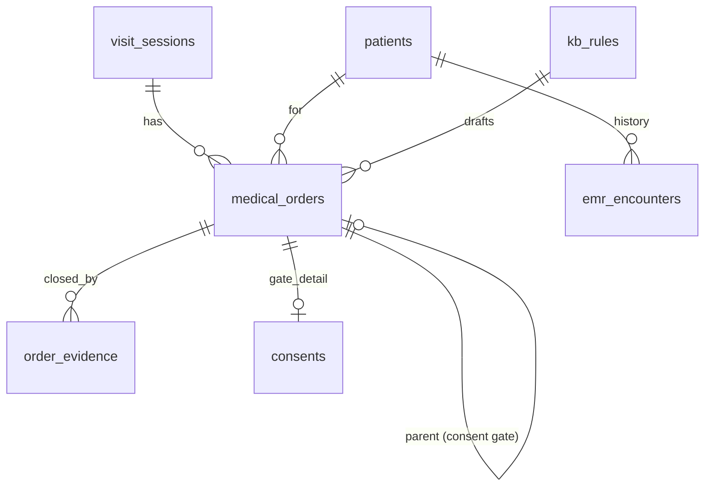
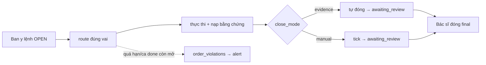

# Aegis Care — Architecture (order-centric)

Hệ thống vận hành phòng khám nha khoa lấy **y lệnh (medical order)** làm vật thể trục.
Thay cho model rounds/lab/checklist trước đây (xem "Legacy" ở cuối). Nguồn thiết kế:
`plans/20260717-brainstorm-clinic-order-compliance-system/brainstorm-report.md` (authoritative).

Nguyên tắc: **Human-first, agent-support · Retrieval KHÔNG inference · Deterministic-first · KHÔNG compliance_score.**

## Stack
- **Frontend:** React 19 + TanStack Router/Start (file-based, SSR shell) + TanStack Query, Tailwind 4 + shadcn/ui.
- **Backend:** Supabase (Postgres + Auth + Realtime), gọi trực tiếp từ client; business logic ở route components hoặc Postgres functions/triggers.
- **AI:** 1 Edge Function `briefing` gọi OpenAI `gpt-4o-mini` (tạm; đổi Anthropic chỉ thay endpoint/model/key) — retrieval-only, chỉ ở Lane2.
- **i18n:** dictionary phẳng `vi`/`en` trong `src/lib/i18n.tsx` — mọi label là key có đủ 2 ngôn ngữ.
- **Lovable:** repo sync branch `main` về editor Lovable. Migration áp qua Supabase SQL Editor.

## Roles (4 vai)
| Role | VN | Việc trong luồng |
|---|---|---|
| `receptionist` | Lễ tân | Check-in (số 0-999/bed), scan consent đóng gate, hàng đợi recall |
| `assistant` | Trợ thủ | Thực thi y lệnh (imaging/lab), nạp bằng chứng |
| `dentist` | Bác sĩ | Đọc panel bối cảnh, viết/ký y lệnh, xem "chờ tôi xem" |
| `admin` | Quản trị | Toàn quyền + gán vai; dashboard vi phạm |

`user_roles` (1..n dòng/user); `is_staff()`/`has_role()` là SQL SECURITY DEFINER dùng trong RLS.
Đa số bảng RLS blanket "any authenticated staff"; `kb_rules`/`nka_systemic_flags`/`dental_snomed_whitelist` admin-gated write. Role gating chi tiết ở UI.

## Data model (trục = medical_orders)

- **`medical_orders`** — y lệnh, vật thể trục. `order_type` (imaging/lab/procedure/medication/follow_up/referral/consent), `status` (open→routed→in_progress→awaiting_review→closed | cancelled), `close_mode` (invariant/evidence/manual), `parent_order_id` (consent = con của procedure), `due_at`, `kb_rule_id`, `is_kb_mandatory`, `exception_reason`, `cancel_reason`. `ordered_by` = chữ ký bác sĩ = thẩm quyền.
- **`order_evidence`** — bằng chứng đóng y lệnh (file phim, scan consent, bản ghi, tick). Trigger tự đóng order khi bằng chứng thỏa.
- **`consents`** — chi tiết cam kết (scan_path, signer, signed_date, force_emergency/force_reason). Gate đóng bằng 4 điều kiện (xem dưới).
- **`kb_rules`** — quy tắc KB theo `procedure_type` → nháp y lệnh điền sẵn (rule engine, KHÔNG LLM).
- **`nka_systemic_flags`** — danh sách bệnh nền phi-nha đổi cách làm răng (chống đông, bisphosphonate, tiểu đường…) cho Lane1.
- **`dental_snomed_whitelist`** — ~134 mã SNOMED nha (trích từ 6 module) lọc Lane2.
- **`emr_*`** (9 bảng) — EMR tham chiếu (Synthea Việt-hóa), read-only, cho Customer Graph.
- **`visit_sessions`** — ca khám (queue số 0-999 / bed_number cấp cứu). Giữ từ model trước; các cột rounds/checklist đã ngừng dùng.
- **`alerts`** — cảnh báo (repoint `order_id`).
- **Views:** `order_violations` (vi phạm treo), `pending_review_orders` ("chờ tôi xem").

## Vòng đời y lệnh + 3 hạng đóng
Ban (OPEN, ký) → route đúng vai → thực thi → **bằng chứng về → tự đóng** → hàng đợi "chờ tôi xem".

- ① **Bất biến giao diện** — dị ứng/tiệt trùng luôn hiện, không tick.
- ② **Tự đóng bằng bằng chứng** — phim→file, consent→scan, recall→lịch. KHÔNG ai tick.
- ③ **Tick tay** — tối thiểu (procedure).

**Vi phạm = query deterministic** (`order_violations`), KHÔNG điểm: y lệnh còn mở khi quá hạn HOẶC khi ca đã `done` (buộc treo vào vòng đời ca, không chỉ due_at); procedure đóng khi consent gate mở (trừ force).

## Consent gate (§4.D)
Consent = y lệnh con (`parent_order_id`) của procedure. KB sinh khi `requires_consent`. Đóng khi ĐỦ 4 (engine `consent_gate_ok`, lễ tân chỉ nhập liệu): scan đính + `procedure_type` khớp nhóm (auto từ parent) + `opened_at ≤ signed_date ≤ hôm nay` (chống ký lùi + ngày tương lai) + người ký hợp lệ (tuổi<18 → guardian). Gate mở → procedure KHÔNG đóng được (trừ force cấp cứu + lý do có audit).

## Customer Graph — 3 lane (retrieval, KHÔNG inference)
- **Lane1 — panel an toàn** (`get_safety_panel`): dị ứng + thuốc đang dùng + cờ bệnh nền. **Toàn thân, hard-query, KHÔNG LLM.** Warfarin ghi ở khám tim mạch vẫn hiện vì gây chảy máu khi nhổ răng. Bất biến giao diện.
- **Lane2 — briefing** (Edge Function `briefing`): tóm tắt bệnh sử NHA (lọc whitelist) bằng LLM, **retrieval-only**, mỗi câu có `encounter_ids` + `verbatim_span`; câu thiếu nguồn / không trích nguyên văn / mang tính suy luận bị loại tại function.
- **Lane3 — CRM/recall** (`get_crm_recall`): khám nha gần nhất, follow_up treo, thủ thuật nha.

Ranh giới: Graph chỉ ĐỌC (panel trái workspace), KB GHI VÀO (nháp phải). Chỉ bác sĩ nối bối cảnh với y lệnh — hệ thống không tự ghi, không phán "nên làm gì".

## Route map theo vai
| Route | Vai | Nội dung |
|---|---|---|
| `/visits/$id` | Bác sĩ | Workspace: SafetyPanel + BriefingPanel (trái) · OrderDraftPanel + ActiveOrders + PendingReview (phải) |
| `/queue` | Trợ thủ | Call board + OrderExecutionList (upload bằng chứng) |
| `/checkin` | Lễ tân | CheckinForm + QueueBoard + ConsentQueue |
| `/follow-ups` | Lễ tân | RecallQueue (follow_up orders) |
| `/dashboard` | Quản lý | ViolationList + AlertsFeed + OpenCasesBoard (đếm treo, KHÔNG điểm) |
| `/my-checklist/$id` | Bệnh nhân (anon) | Checklist xét nghiệm/phim của 1 ca (RPC `get_patient_checklist`, chỉ cột whitelist) |

## Realtime & RLS
- Bảng live (`medical_orders`, `order_evidence`, `alerts`, `visit_sessions`) trong publication `supabase_realtime` + `REPLICA IDENTITY FULL`.
- RLS `is_staff()` blanket cho bảng lâm sàng; `emr_*` staff SELECT-only (PII, KHÔNG anon); storage buckets `order-evidence`/`consent-scans` private, RLS staff.
- Trigger fns SECURITY DEFINER + `search_path`; REVOKE EXECUTE khỏi client.

## Lớp AI agent (trên nền order-centric)
- **Copilot orchestrator** (`/api/copilot`, Vercel AI SDK): chat tra cứu toàn cục, 7 tool (`find_patient`, `kb_search`, `safety_panel`, `patient_history`, `crm_recall`, `open_violations`, `order_drafts`), JWT→RLS (mỗi tool chạy dưới quyền người gọi), retrieval-only. `src/server/copilot/`.
- **RAG compliance KB** (`kb_documents`/`kb_chunks` pgvector + RPC `kb_search` hybrid RRF): văn bản pháp lý/SOP → chunk (pipeline `services/rag-ingest/`) → embed OpenAI `text-embedding-3-small`. Trả trích dẫn (số hiệu văn bản/Điều/Khoản/trang).

## Compliance Judge (gác cổng tại điểm ký y lệnh)
Chạy ngay trước `insertSignedOrders` (`OrderDraftPanel.sign()` → `/api/compliance-judge` → modal → ký). **2 lớp, chỉ lớp tất định có thẩm quyền** — nguyên tắc "zero false assertion" (không bao giờ khẳng định sai; chấp nhận sót):
- **Lớp A tất định** (`src/server/judge/deterministic.ts`): `missing_mandatory` (so `kb_rules` mandatory vs quyết định giữ/bỏ, lấy từ DB không tin client), `safety_flag` (từ `get_safety_panel`, chỉ nêu FACT). Lỗi RPC → 502, KHÔNG trả "clean" giả. → chặn mềm (buộc ack + lý do, ghi audit).
- **Lớp B RAG** (`rag`/`schema`/`prompt`/`citation-guard`.ts): `kb_search` → gpt-4o-mini temp 0 → advisory + `insufficient`. **Hậu-kiểm citation server-side**: drop advisory có trích dẫn không map vào chunk thật của lượt đó (`guardCitations`) — biến zero-false-assertion thành cưỡng chế, không chỉ prompt.
- Output `{hard_findings, advisories, insufficient, verdict}` (KHÔNG điểm). Audit mỗi lượt vào `compliance_judgments`.

## Customer Graph SỐNG (auto-append)
`emr_*` mang cột `source` ('synthea' seed | 'clinic' vận hành). Trigger tự đẩy vào graph: visit 'done' → `emr_encounters` + **chẩn đoán (`visit_sessions.diagnosis`) → `emr_conditions`** (mig 130000); order procedure/medication đóng → `emr_procedures`/`emr_medications`. BN mới KHÔNG cần ETL vẫn có graph; briefing bypass whitelist cho dòng clinic. Imaging: chưa xử lý (scope).

## Legacy (đã ngừng dùng)
Model cũ rounds/lab/checklist/follow_ups/compliance_score chạy song song tới khi UI chuyển xong, rồi drop qua `20260718090000_drop_legacy_model_OPTIONAL.sql` (optional, apply sau demo + backup). `types.ts` cần regenerate sau khi drop (hiện UI cast `ordersDb` cho bảng mới vì types.ts chưa regen).
