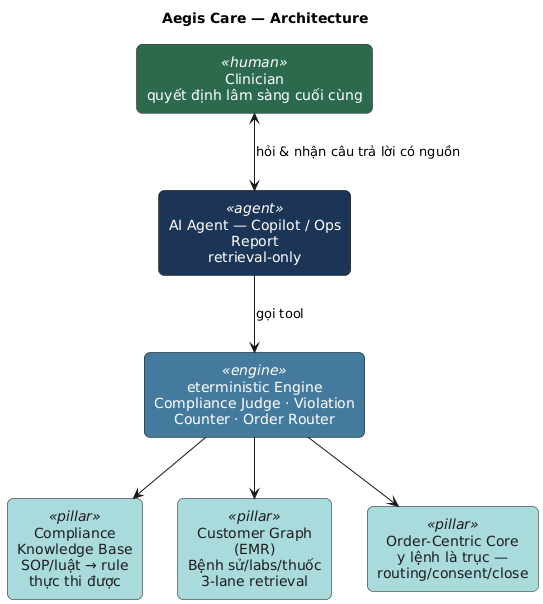

# Aegis Care

**AI Clinic Operations Assistant** for dental clinics — VAIC 2026 entry. Aegis Care keeps every clinical decision with the clinician; the AI agent runs underneath to retrieve knowledge, watch process, and surface risk — never to diagnose or decide.

## Where the AI is



The AI Agent is a single `generateText()` call with a tool loop (max 5–12 steps, `stopWhen`) over **8 tools** — `kb_search`, `find_patient`, `safety_panel`, `patient_history`, `crm_recall`, `patient_labs`, `open_violations`, `order_drafts`. Every tool returns a **fact + citation**; the orchestrator narrates what the tools found, it never infers between steps. Full data-flow diagram: [`docs/architecture-pitch-deck.puml`](docs/architecture-pitch-deck.puml).

**Invariants (enforced in the system prompt, not just documented):**
- **Human-first, agent-support** — the clinician makes every clinical call.
- **Retrieval, not inference** — the agent cites tool output, never diagnoses or recommends.
- **Deterministic-first** — safety checks and compliance violations are hard SQL queries/triggers, never LLM judgment.
- **No compliance score** — a violation is an open order that never closed, counted, not scored.

## The three pillars

1. **Compliance Knowledge Base** — SOPs/MoH regulations as executable rules (`kb_rules`, a deterministic rule engine → order drafts) plus a citation-backed RAG corpus (`kb_chunks`, pgvector) for legal Q&A.
2. **Customer Graph (EMR)** — unified patient history/labs/meds read through a 3-lane retrieval layer that surfaces facts (value + unit + date + reference range), never a verdict.
3. **AI Agent** — advises with cited data, judges orders against the KB + record, flags gaps. Realized as the copilot orchestrator (`/api/copilot`), the deterministic violation engine, and the on-demand AI Ops Report.

## Docs

- [`ARCHITECTURE.md`](ARCHITECTURE.md) — order-centric core, order lifecycle, roles/RLS, route map.
- [`CLAUDE.md`](CLAUDE.md) — full system description, stack, conventions.
- [`docs/`](docs) — architecture diagrams (class, deployment, component, agent sequence).

## Stack

React 19 + TanStack Start/Router + TanStack Query · Tailwind 4 + shadcn/ui · Supabase (Postgres + Auth + Realtime + pgvector) · Vercel · Vercel AI SDK (`ai`, `@ai-sdk/openai`).

## Commands

```bash
npm run dev       # Vite dev server on http://localhost:8080
npm run build     # Production build → .output/
npm run preview   # Preview the production build
npm run lint      # ESLint
npx tsc --noEmit  # Typecheck
```
